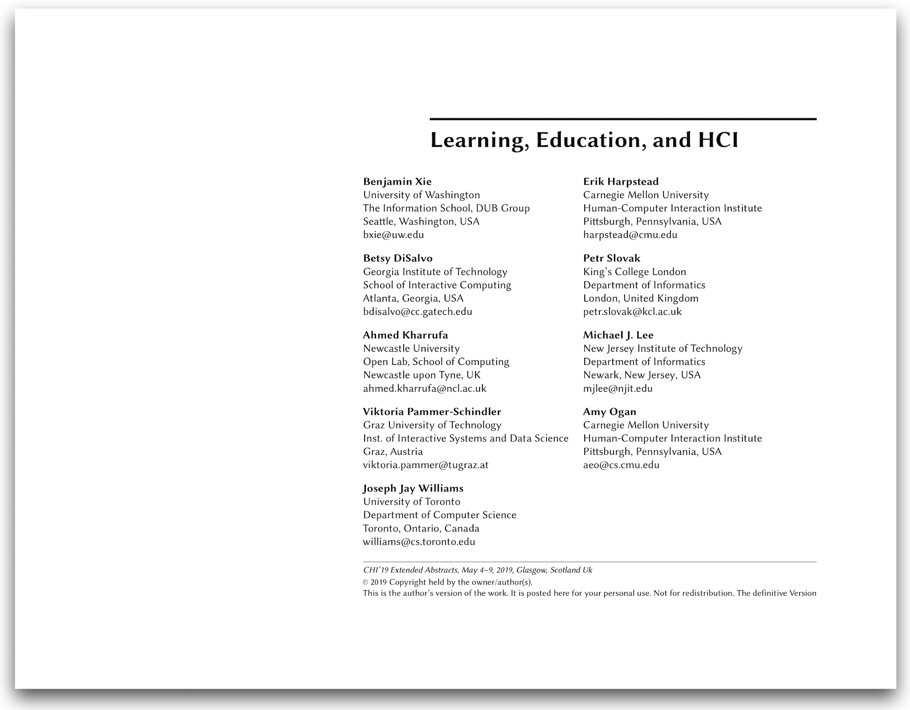

**To better support HCI in learning and educational contexts, we are hosting a special interest group (SIG) for CHI 2019**. 

This SIG will bring together researchers, educators, and practitioners with three goals in mind: 
1. Discussing more inclusive cross-disciplinary perspectives on learning.
2. Defining future directions and standards for learning and education contributions in CHI.
3. Building community across research/practice boundaries.

We are proposing this SIG in response to a growing interest in learning-related papers, as signaled by a 40% increase in CHI submissions relating to learning in recent years and the creation of the _Learning, Education, and Families_ subcommittee for CHI 2019.

# Learn more

    

To learn more about our SIG, read our short [write-up on our SIG on Learning, Education, and HCI][writeup] (accepted to CHI 2019).

# Get involved!

Are you a researcher, professional, educator, or caring human interested in how we interact with technology in the learning contexts? 
Then find out more and/or getting involved! 

Attend our SIG at CHI '19 ([CHI schedule](https://chi2019.acm.org/for-attendees/full-schedule-of-events/)).

Reach out to [Benji Xie](http://benjixie.com) (PhD student, Univ of Washington) on Twitter ([@benjixie](https://twitter.com/benjixie)) or by email (bxie@uw.edu).

# Schedule for SIG at CHI '19
_Coming soon!_

# Organizers
We are faculty, researchers, and students from eight universities from three countries with diverse perspectives on learning, education, and HCI.
- Benjamin Xie (Univ. of Washington)
- Erik Harpstead (Carnegie Mellon University)
- Betsy DiSalvo (Georgia Institute of Technology)
- Petr Slovak (King’s College London)
- Ahmed Kharrufa (Newcastle University)
- Michael J. Lee (New Jersey Institute of Technology)
- Viktoria Pammer-Schindler (Graz University of Technology)
- Amy Ogan (Carnegie Mellon University)
- Joseph Jay Williams (University of Toronto)

[img-siglearn]: img/siglearn-drop.png
[writeup]: 2019chi_learnEduHci.pdf